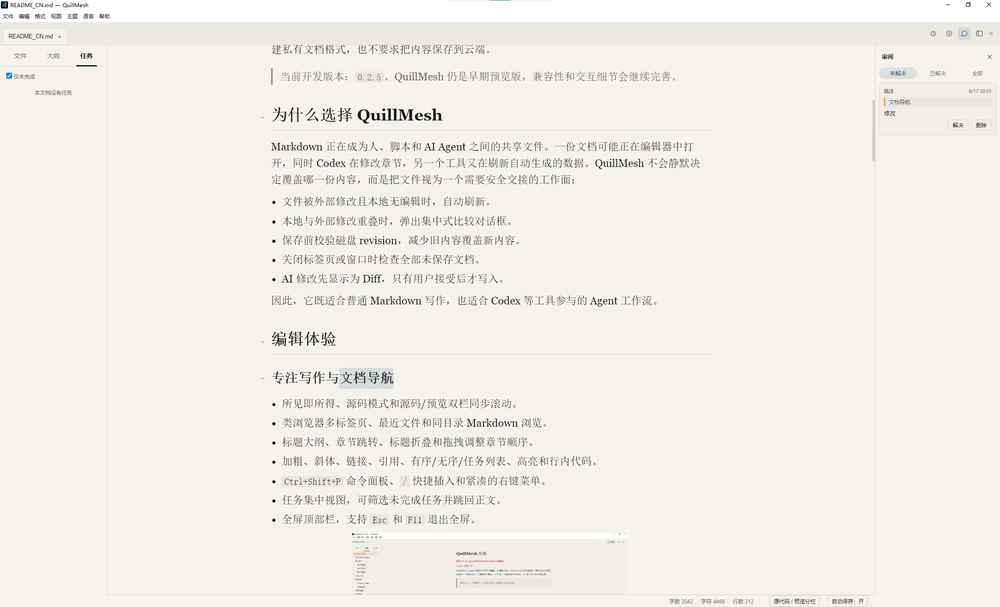

# QuillMesh

**A local-first Markdown editor for focused writing, review, and safe AI collaboration.**

**English** · [简体中文](README_CN.md)

[](https://github.com/lbiao2965-bot/QuillMesh/releases)
[](LICENSE)
[](#build-from-source)

QuillMesh brings a calm, Typora-inspired editing experience to ordinary Markdown files. It combines WYSIWYG writing, document navigation, review comments, formulas, tables, images, export, and revision-safe coordination with external tools—without a proprietary document format or mandatory cloud storage.

> Current development version: `0.2.6`. QuillMesh is an early preview; compatibility and interaction details will continue to improve.

<p align="center">
  
</p>

## Why QuillMesh

Markdown is increasingly shared by people, scripts, and AI agents. A document may be open locally while Codex updates a section or another tool refreshes generated content. QuillMesh treats the file as a shared handoff surface instead of silently overwriting one version with another:

- clean documents refresh automatically after external writes;
- overlapping local and external edits open a focused comparison dialog;
- saves verify the on-disk revision before replacing content;
- closing a tab or window checks every unsaved document;
- AI proposals remain visible as reviewed Diffs until accepted or rejected.

The result is a Markdown editor that feels natural for everyday writing and remains safer when agents or automation participate in the workflow.

## Write and navigate

- WYSIWYG, source, and synchronized source/preview split modes.
- Browser-like tabs, recent files, and sibling Markdown browsing.
- Outline navigation, heading folding, and drag-to-reorder sections.
- Bold, italic, links, quotes, ordered, unordered and task lists, highlight, and inline code.
- `Ctrl+Shift+P` command palette, `/` quick insert, and context-aware menus.
- Consolidated task view with incomplete-task filtering and jump-to-source behavior.
- Full-screen toolbar with `Esc` and `F11` exit support.

<p align="center">
  
</p>

## Review without changing the Markdown

Select text and add a comment from the context menu, then manage the discussion in the Review panel. Review data is stored beside the document in `.quillmesh/<filename>.annotations.json`, leaving the Markdown source clean and portable.

- Highlight comment anchors directly in the rendered document.
- Filter open, resolved, or all comments.
- Resolve, reopen, or delete comments without touching the Markdown body.
- Keep Codex suggestions in the same review surface with Accept and Reject actions.
- Re-locate annotations from their text and surrounding context after nearby edits.

<p align="center">
  
</p>

## Tables, code, links, and insertion

- GFM table editing, whole-table alignment, contextual row and column actions, copy/delete, and draggable column widths.
- Code-block copy, language selection, and optional line wrapping.
- Insert images, tables, code blocks, formulas, horizontal rules, or paragraphs above and below.
- Link hover previews with open and copy actions.

<p align="center">
  
</p>

## LaTeX formulas

- Inline math and centered display math rendered by KaTeX.
- Live preview while editing LaTeX.
- Visual palettes for common symbols, Greek letters, set and logic notation, and calculus operators.
- Reusable templates for fractions, roots, matrices, piecewise functions, and equation systems.
- LaTeX command autocomplete, selection-aware insertion, favorites, and recent-formula history.
- Optional automatic numbering for block equations.
- Formula-aware HTML, PDF, PNG, and DOCX export.

<p align="center">
  
</p>

## Images and local assets

- Paste clipboard images into a document-local `assets/` folder.
- Keep portable relative paths in Markdown.
- Resize images visually with drag handles.
- Copy an image, reset its size, or reveal it in the file manager from the context menu.
- Open a lightbox preview, then zoom with the mouse wheel and drag to pan.

<p align="center">
  
</p>

## Personal settings

Open Settings from the home page, **File → Settings**, or `Ctrl+,`.

- Elegant, Light, Dark, Newsprint, or imported CSS themes.
- Theme, sans-serif, serif, or monospace editor fonts.
- Font size, line spacing, and content width.
- Autosave and status-bar controls.
- Windows Markdown default-app status and a direct link to system confirmation.
- Optional Codex integration, disabled by default.

Preferences are stored locally and restored on the next launch.

## Optional Codex collaboration

The repository includes [QuillMesh Companion](plugins/quillmesh-companion/README.md), a local Codex plugin and MCP service. When enabled in Settings, Codex can read the active document, cursor, selection, or section; inspect Markdown and formulas; propose revision-bound changes; locate content in QuillMesh; and request PDF, PNG, HTML, or DOCX export.

A reviewed workflow stays explicit:

1. Select text or place the cursor in a section in QuillMesh.
2. Send the selection, section, or full document to Codex.
3. Codex prepares a proposal against the current document revision.
4. QuillMesh displays the change as a Diff and records it in Review.
5. Accept or reject it; accepted changes pass another revision check before writing.

The bridge listens only on `127.0.0.1` and uses a random bearer token. QuillMesh does not upload documents to a separate hosted bridge.

## Export

QuillMesh exports the active document to PDF, PNG image, self-contained HTML, and Microsoft Word `.docx`.

## Download and run

### Preview installers

Download preview installers from [GitHub Releases](https://github.com/lbiao2965-bot/QuillMesh/releases). Preview packages may be unsigned and can trigger an operating-system security warning.

The Windows installer registers QuillMesh as an available handler for `.md`, `.markdown`, `.mdown`, and `.mkd`. Windows keeps the final default-app choice under user control. After installation, open **Settings → Files → Manage default apps**, then choose QuillMesh for the Markdown extensions you use.

### Build from source

Requirements: Node.js 22.12 or newer and npm.

```powershell
git clone https://github.com/lbiao2965-bot/QuillMesh.git
cd QuillMesh
npm install
npm run dev
```

Verify and package:

```powershell
npm run verify
npm run dist:win
npm run dist:mac
npm run dist:linux
```

Artifacts are written to `release/` by default.

## Useful shortcuts

| Action | Windows / Linux | macOS |
| --- | --- | --- |
| Open file | `Ctrl+O` | `⌘O` |
| Save / Save As | `Ctrl+S` / `Ctrl+Shift+S` | `⌘S` / `⌘⇧S` |
| Close tab | `Ctrl+W` | `⌘W` |
| Settings | `Ctrl+,` | `⌘,` |
| Command palette | `Ctrl+Shift+P` | `⌘⇧P` |
| Search | `Ctrl+F` | `⌘F` |
| Bold / italic | `Ctrl+B` / `Ctrl+I` | `⌘B` / `⌘I` |
| Link | `Ctrl+K` | `⌘K` |
| Headings 1–6 | `Ctrl+1`–`Ctrl+6` | `⌘1`–`⌘6` |
| Source mode | `Ctrl+/` | `⌘/` |
| Insert/edit formula | `Ctrl+Shift+E` | `⌘⇧E` |
| Insert image | `Ctrl+Shift+I` | `⌘⇧I` |
| Insert code block | `Ctrl+Shift+K` | `⌘⇧K` |
| Toggle full screen | `F11` | `⌃⌘F` |
| Exit full screen | `Esc` | `Esc` |

Review mode and Add comment are also available from the command palette and the editor context menu.

## Project structure

```text
src/main/       Electron main process, document sessions, annotations, export, and local bridge
src/preload/    Typed IPC boundary
src/renderer/   Milkdown/ProseMirror editor, review tools, and desktop UI
src/shared/     Shared settings, types, and translations
resources/      Icons, demos, and built-in templates
themes/         Example CSS themes
plugins/        QuillMesh Companion plugin and MCP service
assets/         Product screenshots used by this README
```

See [docs/ARCHITECTURE.md](docs/ARCHITECTURE.md) for implementation details, [CONTRIBUTING.md](CONTRIBUTING.md) for the development workflow, [SECURITY.md](SECURITY.md) for responsible vulnerability reporting, and [docs/SIGNING.md](docs/SIGNING.md) for release-signing requirements.

## Roadmap

- Improve CommonMark/GFM and common Typora compatibility.
- Continue long-document performance work.
- Expand review anchors, asset management, and export fidelity.
- Polish Companion installation and reviewed agent workflows.
- Publish signed Windows and notarized macOS builds.

## License and attribution

QuillMesh is distributed under the [MIT License](LICENSE).

QuillMesh is derived from [ColaMD](https://github.com/marswaveai/ColaMD). Copyright in the original work remains with `marswave.ai`; QuillMesh contributors retain rights in their respective additions and modifications. Keep the original copyright and permission notice in [LICENSE](LICENSE) and [NOTICE](NOTICE).
