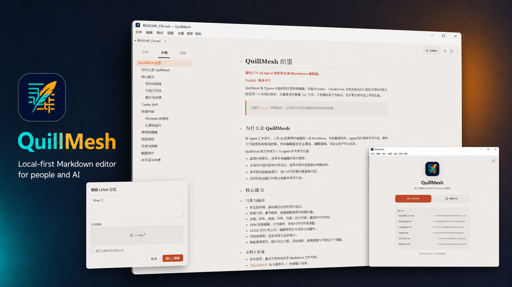

# QuillMesh

**A polished, local-first Markdown editor for focused writing and safe AI collaboration.**

**English** · [简体中文](README_CN.md)

[](https://github.com/lbiao2965-bot/QuillMesh/releases)
[](LICENSE)
[](#build-from-source)

<p align="center">
  
</p>

QuillMesh brings a calm, Typora-inspired WYSIWYG experience to ordinary Markdown files. It combines rich editing, document navigation, formulas, tables, images, export, and revision-safe coordination with external tools—without introducing a proprietary document format or requiring cloud storage.

> Current development version: `0.2.5`. QuillMesh is an early preview; compatibility and interaction details are still evolving.

## What makes QuillMesh different

Markdown increasingly sits between people, scripts, and AI agents. A document may be open in an editor while Codex updates a section or another tool refreshes generated content. QuillMesh treats the file as a shared handoff surface instead of silently choosing a winner:

- Clean documents refresh automatically after external writes.
- Overlapping edits open a focused comparison dialog.
- Saves verify the on-disk revision before replacing content.
- Unsaved tabs and windows always receive a close check.
- AI proposals are shown as reviewed Diffs and are written only after acceptance.

The result is a Markdown editor that remains pleasant for normal writing while being much safer in agent-assisted workflows.

## Editing experience

### Focused writing and navigation

- WYSIWYG, source, and synchronized source/preview split modes.
- Browser-like tabs, recent files, and sibling Markdown browsing.
- Outline navigation, heading folding, and drag-to-reorder sections.
- Bold, italic, links, quotes, ordered/unordered/task lists, highlight, and inline code.
- `Ctrl+Shift+P` command palette, `/` quick insert, and a compact context menu.
- Consolidated task view with incomplete-task filtering and jump-to-source behavior.
- Full-screen toolbar with `Esc` and `F11` exit support.

<p align="center">
  
</p>

### Tables, code, and quick insertion

- GFM table editing, whole-table alignment, row/column actions, copy/delete, and draggable column widths.
- Code-block copy, language selection, and optional line wrapping.
- Insert images, tables, code blocks, formulas, horizontal rules, or paragraphs above and below.
- Link hover previews with open and copy actions.

<p align="center">
  
</p>

### LaTeX formulas

- Inline math and centered display math through KaTeX.
- Live preview while editing LaTeX.
- Visual palettes for common symbols, Greek letters, set and logic notation, and calculus operators.
- Reusable formula templates for fractions, roots, matrices, piecewise functions, and equation systems.
- LaTeX command autocomplete, selection-aware insertion, favorites, and recent-formula history.
- Optional automatic numbering for block equations.
- Formula-aware HTML, PDF, PNG, and DOCX export.

<p align="center">
  
</p>

### Images and local assets

- Paste clipboard images directly into a document-local `assets/` folder.
- Keep portable relative paths in Markdown.
- Resize images visually with drag handles.
- Copy an image, reset its size, or reveal it in the file manager from the context menu.
- Click for a lightbox preview, then use the mouse wheel to zoom and drag to pan.

<p align="center">
  
</p>

## Personal settings

Open Settings from the home page, **Edit → Settings**, or `Ctrl+,`.

- Theme: Elegant, Light, Dark, Newsprint, or imported CSS.
- Editor font: follow the theme, sans serif, serif, or monospace.
- Font size, line spacing, and content width.
- Autosave and status-bar controls.
- Windows Markdown default-app status and a direct link to the system confirmation page.
- Optional Codex integration.

Preferences are stored locally and restored on the next launch.

## Optional Codex collaboration

Codex integration is **off by default**. When it is disabled, QuillMesh does not show Codex controls and does not start the local Companion bridge. Enable it in Settings only when you want the workflow.

The repository includes [QuillMesh Companion](plugins/quillmesh-companion/README.md), a local Codex plugin and MCP service. Once installed and enabled, Codex can:

- read the active document, cursor, selection, or current section;
- inspect Markdown structure, formulas, tables, quotes, tasks, and image paths;
- open a document at a heading or approximate line;
- propose exact or multi-paragraph edits;
- return changes to QuillMesh as a visible Diff;
- request PDF, PNG, HTML, or DOCX export.

A typical reviewed workflow is:

1. Select text or place the cursor in a section in QuillMesh.
2. Send the selection, section, or document to Codex.
3. Codex prepares a revision-bound proposal.
4. QuillMesh displays the Diff at the document level.
5. Accept or reject it. Accepted changes pass another revision check before writing.

The bridge listens only on `127.0.0.1` and uses a random bearer token. QuillMesh does not upload documents to a separate hosted bridge.

## Export

QuillMesh can export the active document to:

- PDF
- PNG image
- self-contained HTML
- Microsoft Word `.docx`

## Download and run

### Preview installers

Download available Windows preview installers from [GitHub Releases](https://github.com/lbiao2965-bot/QuillMesh/releases). Preview packages may be unsigned and can trigger an operating-system security warning.

The Windows installer registers QuillMesh as an available handler for `.md`, `.markdown`, `.mdown`, and `.mkd`. Windows requires an administrator-approved installation and keeps the final default-app choice under user control. After installation, open **Settings → Files → Manage default apps**, then select QuillMesh for `.md` and `.markdown`.

### Build from source

Requirements: Node.js 22.12 or newer and npm.

```powershell
git clone https://github.com/lbiao2965-bot/QuillMesh.git
cd QuillMesh
npm install
npm run dev
```

Build and verify:

```powershell
npm run verify
```

Create a platform package:

```powershell
npm run dist:win
npm run dist:mac
npm run dist:linux
```

Artifacts are written to `release/` by default.

## Useful shortcuts

| Action | Windows / Linux | macOS |
| --- | --- | --- |
| Open file | `Ctrl+O` | `⌘O` |
| Save / Save As | `Ctrl+S` / `Ctrl+Shift+S` | `⌘S` / `⌘⇧S` |
| Close tab | `Ctrl+W` | `⌘W` |
| Settings | `Ctrl+,` | `⌘,` |
| Command palette | `Ctrl+Shift+P` | `⌘⇧P` |
| Search | `Ctrl+F` | `⌘F` |
| Bold / italic | `Ctrl+B` / `Ctrl+I` | `⌘B` / `⌘I` |
| Link | `Ctrl+K` | `⌘K` |
| Headings 1–6 | `Ctrl+1`–`Ctrl+6` | `⌘1`–`⌘6` |
| Source mode | `Ctrl+/` | `⌘/` |
| Insert/edit formula | `Ctrl+Shift+E` | `⌘⇧E` |
| Insert image | `Ctrl+Shift+I` | `⌘⇧I` |
| Insert code block | `Ctrl+Shift+K` | `⌘⇧K` |
| Toggle full screen | `F11` | `⌃⌘F` |
| Exit full screen | `Esc` | `Esc` |

## Project structure

```text
src/main/       Electron main process, document sessions, conflict safety, export, and local bridge
src/preload/    Typed IPC boundary
src/renderer/   Milkdown/ProseMirror editor and desktop UI
src/shared/     Shared settings, types, and translations
resources/      Icons, demos, and built-in templates
themes/         Example CSS themes
plugins/        QuillMesh Companion plugin and MCP service
assets/         Product screenshots used by this README
```

See [docs/ARCHITECTURE.md](docs/ARCHITECTURE.md) for implementation details, [CONTRIBUTING.md](CONTRIBUTING.md) for the development workflow, [SECURITY.md](SECURITY.md) for responsible vulnerability reporting, and [docs/SIGNING.md](docs/SIGNING.md) for release-signing requirements.

## Roadmap

- Improve CommonMark/GFM and common Typora compatibility.
- Continue long-document performance work.
- Expand cross-directory asset management and export fidelity.
- Polish Companion installation and reviewed agent workflows.
- Publish signed Windows and notarized macOS builds.

## License and attribution

QuillMesh is distributed under the [MIT License](LICENSE).

QuillMesh is derived from [ColaMD](https://github.com/marswaveai/ColaMD). Copyright in the original work remains with `marswave.ai`; QuillMesh contributors retain rights in their respective additions and modifications. Keep the original copyright and permission notice in [LICENSE](LICENSE) and [NOTICE](NOTICE).
