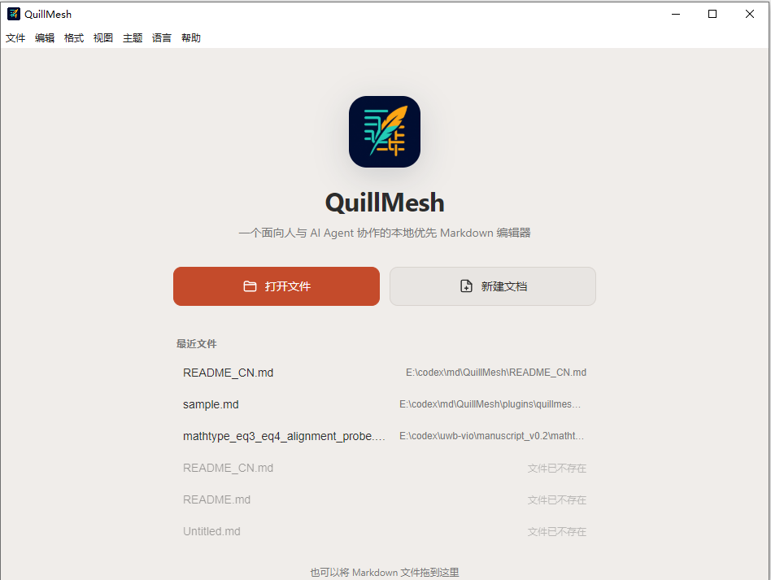
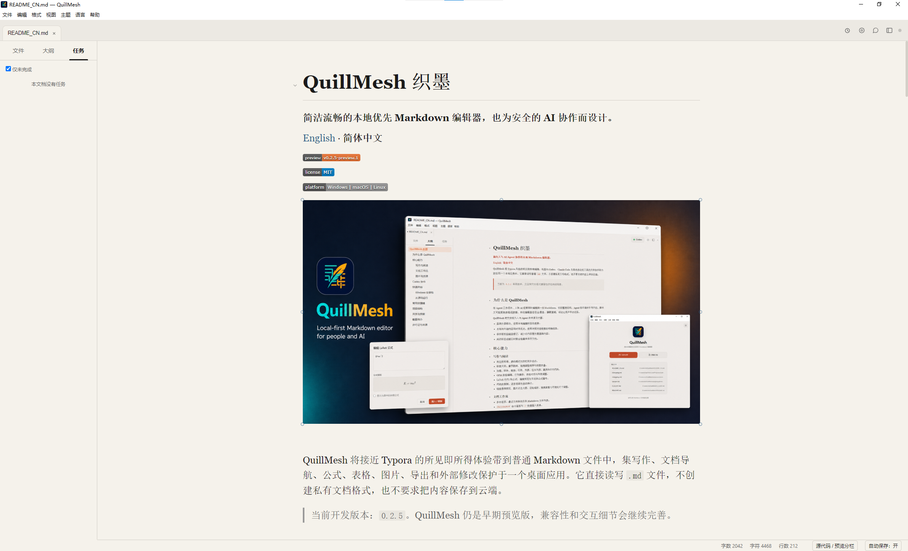
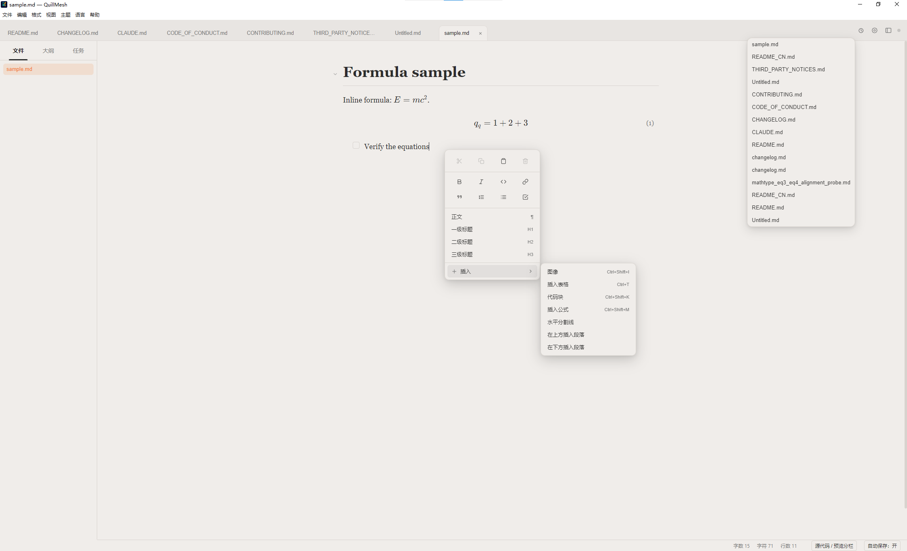
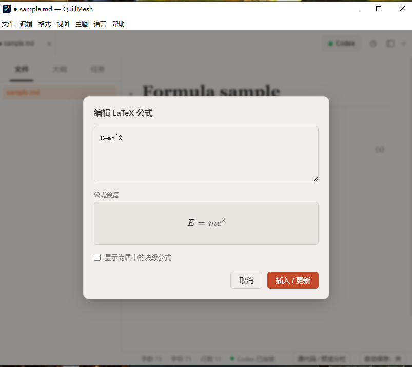
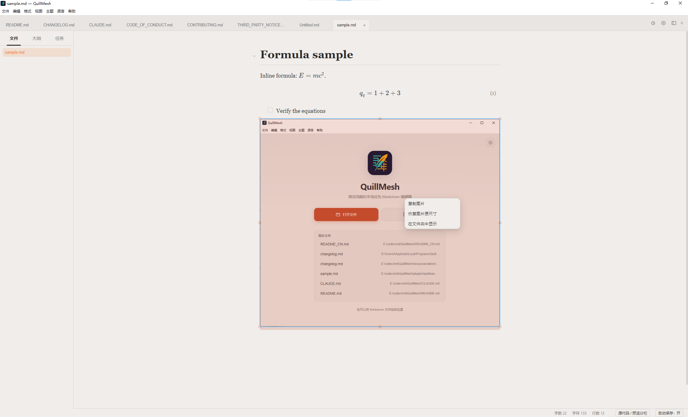

# QuillMesh 织墨

**简洁流畅的本地优先 Markdown 编辑器，也为安全的 AI 协作而设计。**

[English](README.md) · **简体中文**

[](https://github.com/lbiao2965-bot/QuillMesh/releases)
[](LICENSE)
[](#从源码运行)

QuillMesh 将接近 Typora 的所见即所得体验带到普通 Markdown 文件中，集写作、文档导航、公式、表格、图片、导出和外部修改保护于一个桌面应用。它直接读写 `.md` 文件，不创建私有文档格式，也不要求把内容保存到云端。

> 当前开发版本：`0.2.2`。QuillMesh 仍是早期预览版，兼容性和交互细节会继续完善。

<p align="center">
  
</p>

## 为什么选择 QuillMesh

Markdown 正在成为人、脚本和 AI Agent 之间的共享文件。一份文档可能正在编辑器中打开，同时 Codex 在修改章节，另一个工具又在刷新自动生成的数据。QuillMesh 不会静默决定覆盖哪一份内容，而是把文件视为一个需要安全交接的工作面：

- 文件被外部修改且本地无编辑时，自动刷新。
- 本地与外部修改重叠时，弹出集中式比较对话框。
- 保存前校验磁盘 revision，减少旧内容覆盖新内容。
- 关闭标签页或窗口时检查全部未保存文档。
- AI 修改先显示为 Diff，只有用户接受后才写入。

因此，它既适合普通 Markdown 写作，也适合 Codex 等工具参与的 Agent 工作流。

## 编辑体验

### 专注写作与文档导航

- 所见即所得、源码模式和源码/预览双栏同步滚动。
- 类浏览器多标签页、最近文件和同目录 Markdown 浏览。
- 标题大纲、章节跳转、标题折叠和拖拽调整章节顺序。
- 加粗、斜体、链接、引用、有序/无序/任务列表、高亮和行内代码。
- `Ctrl+Shift+P` 命令面板、`/` 快捷插入和紧凑的右键菜单。
- 任务集中视图，可筛选未完成任务并跳回正文。
- 全屏顶部栏，支持 `Esc` 和 `F11` 退出全屏。

<p align="center">
  
</p>

### 表格、代码与快速插入

- GFM 表格编辑、整表对齐、行列操作、复制/删除和拖动调整列宽。
- 代码块一键复制、语言选择和自动换行。
- 插入图片、表格、代码块、公式、水平分割线，以及上下段落。
- 链接悬浮预览，并支持打开和复制链接。

<p align="center">
  
</p>

### LaTeX 公式

- 通过 KaTeX 渲染行内公式和居中块公式。
- 编辑 LaTeX 时实时预览结果。
- 可选的块公式自动编号。
- HTML、PDF、PNG 和 DOCX 导出保留公式内容。

<p align="center">
  
</p>

### 图片与本地资源

- 粘贴剪贴板图片时自动保存到文档旁的 `assets/` 文件夹。
- Markdown 中使用便于迁移的相对路径。
- 拖动控制点可视化调整图片大小。
- 右键复制图片、恢复原始尺寸或在文件夹中显示。
- 点击打开大图预览，滚轮缩放并拖动查看。

<p align="center">
  
</p>

## 个性化设置

可以从主页右上角齿轮、**编辑 → 设置**或 `Ctrl+,` 打开设置。

- 主题：典雅、浅色、深色、报纸或导入自定义 CSS。
- 编辑字体：跟随主题、无衬线、衬线或等宽字体。
- 字号、行距和页面宽度。
- 自动保存与状态栏开关。
- 可选的 Codex 集成。

设置保存在本机，重启后会自动恢复。

## 可选的 Codex 协作

Codex 集成**默认关闭**。关闭时，主页和编辑界面不会展示 Codex 控件，QuillMesh 也不会启动本地 Companion 桥接服务。需要时可在设置中主动开启。

仓库包含 [QuillMesh Companion](plugins/quillmesh-companion/README.md)，它是一个面向 Codex 的本地插件和 MCP 服务。安装并启用后，Codex 可以：

- 读取当前文档、光标、选区或当前章节；
- 检查 Markdown 结构、公式、表格、引用、任务和图片路径；
- 打开文档并定位到标题或近似行号；
- 提交精确替换或多段修改；
- 把修改作为明显的 Diff 返回 QuillMesh；
- 按要求导出 PDF、PNG、HTML 或 DOCX。

典型的安全协作流程：

1. 在 QuillMesh 中选中文字，或把光标放在目标章节。
2. 将选区、章节或全文任务发送给 Codex。
3. Codex 基于当前 revision 准备修改建议。
4. QuillMesh 显示文档级 Diff。
5. 你选择接受或拒绝；接受时再次校验 revision 后写入。

桥接服务仅监听 `127.0.0.1`，并使用随机 bearer token。QuillMesh 不会把文档上传到独立的云端桥接服务。

## 导出格式

QuillMesh 可以将当前文档导出为：

- PDF
- PNG 图片
- 独立 HTML
- Microsoft Word `.docx`

## 下载与运行

### 预览安装包

可在 [GitHub Releases](https://github.com/lbiao2965-bot/QuillMesh/releases) 下载已发布的 Windows 预览安装包。预览包可能尚未签名，系统可能显示安全提示。

### 从源码运行

需要 Node.js 22.12 或更高版本及 npm。

```powershell
git clone https://github.com/lbiao2965-bot/QuillMesh.git
cd QuillMesh
npm install
npm run dev
```

构建并验证：

```powershell
npm run verify
```

生成各平台安装包：

```powershell
npm run dist:win
npm run dist:mac
npm run dist:linux
```

构建产物默认位于 `release/`。

## 常用快捷键

| 操作 | Windows / Linux | macOS |
| --- | --- | --- |
| 打开文件 | `Ctrl+O` | `⌘O` |
| 保存 / 另存为 | `Ctrl+S` / `Ctrl+Shift+S` | `⌘S` / `⌘⇧S` |
| 关闭标签页 | `Ctrl+W` | `⌘W` |
| 设置 | `Ctrl+,` | `⌘,` |
| 命令面板 | `Ctrl+Shift+P` | `⌘⇧P` |
| 搜索 | `Ctrl+F` | `⌘F` |
| 加粗 / 斜体 | `Ctrl+B` / `Ctrl+I` | `⌘B` / `⌘I` |
| 链接 | `Ctrl+K` | `⌘K` |
| 标题 1–6 | `Ctrl+1`–`Ctrl+6` | `⌘1`–`⌘6` |
| 源码模式 | `Ctrl+/` | `⌘/` |
| 插入/编辑公式 | `Ctrl+Shift+E` | `⌘⇧E` |
| 插入图片 | `Ctrl+Shift+I` | `⌘⇧I` |
| 插入代码块 | `Ctrl+Shift+K` | `⌘⇧K` |
| 切换全屏 | `F11` | `⌃⌘F` |
| 退出全屏 | `Esc` | `Esc` |

## 项目结构

```text
src/main/       Electron 主进程、文档会话、冲突保护、导出和本地桥接
src/preload/    类型化 IPC 边界
src/renderer/   Milkdown/ProseMirror 编辑器与桌面界面
src/shared/     共享设置、类型和翻译
resources/      图标、演示文档和内置模板
themes/         示例 CSS 主题
plugins/        QuillMesh Companion 插件与 MCP 服务
assets/         README 产品截图
```

实现细节见 [架构文档](docs/ARCHITECTURE_CN.md)，开发约定见 [CONTRIBUTING.md](CONTRIBUTING.md)，安全问题报告方式见 [SECURITY.md](SECURITY.md)，签名发布要求见 [docs/SIGNING.md](docs/SIGNING.md)。

## 路线图

- 完善 CommonMark/GFM 与 Typora 常见写法的兼容性。
- 继续优化超长文档性能。
- 改进跨目录资源管理和导出保真度。
- 完善 Companion 安装和 Diff 审阅工作流。
- 发布带签名的 Windows 构建和经过公证的 macOS 构建。

## 许可证与来源

QuillMesh 依 [MIT License](LICENSE) 开源。

QuillMesh 基于 [ColaMD](https://github.com/marswaveai/ColaMD) 修改和扩展。原始作品版权归 `marswave.ai` 所有；QuillMesh contributors 对各自新增和修改部分保留相应权利。请保留 [LICENSE](LICENSE) 和 [NOTICE](NOTICE) 中的原始版权及许可声明。
