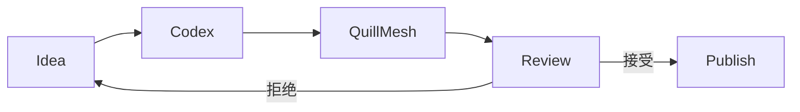
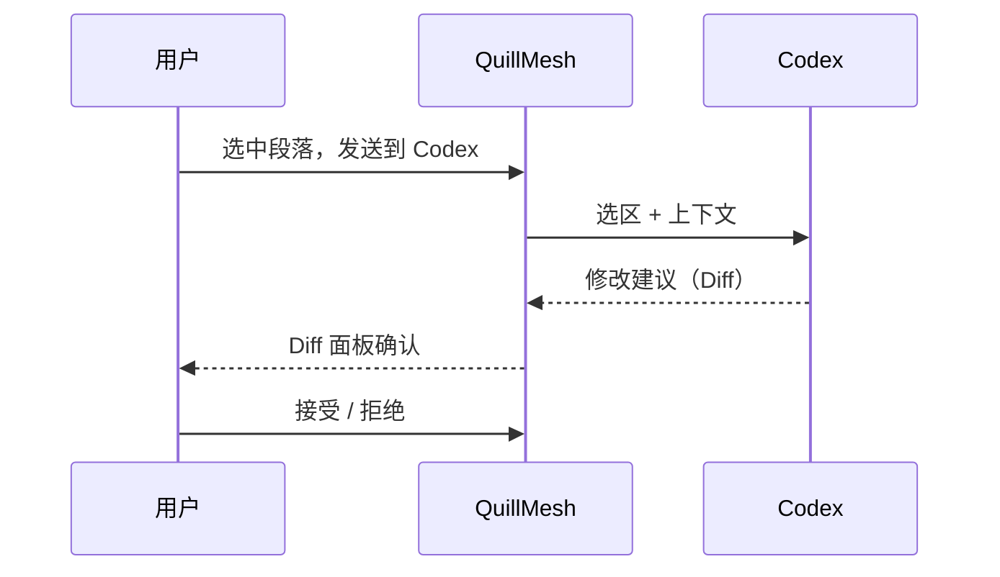
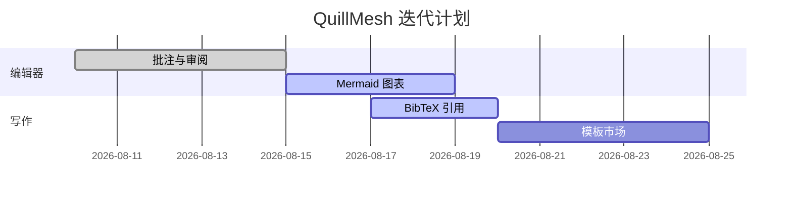
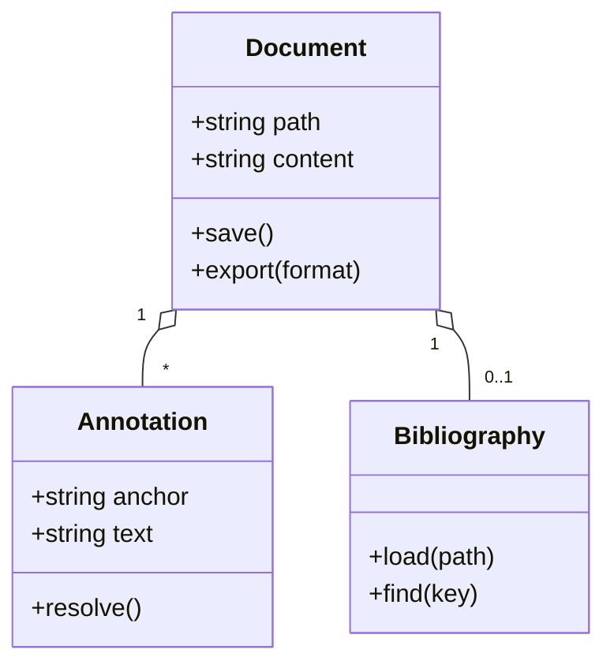
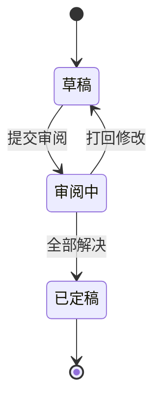
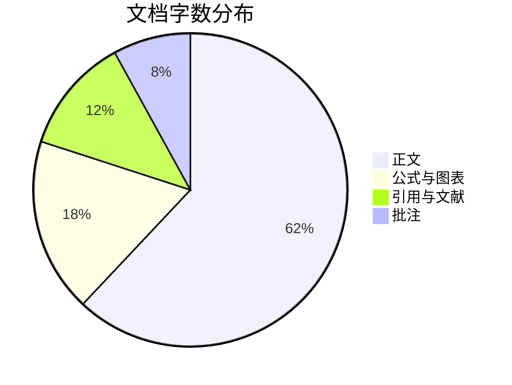

# Mermaid 与引用功能演示

> 体验清单：
>
> 1. 默认只显示渲染好的图表；点卡片工具栏的"**代码**"才显示源码（光标进入源码也会自动显现）
> 2. 图表卡片**悬停**会出现工具栏：全屏 / 保存 / 复制 / 代码·预览切换
> 3. **双击图表**打开"源码＋实时预览"编辑卡片（可拖动）
> 4. **右键图表**：编辑源码、复制为 SVG / PNG
> 5. **右键正文 → 插入引文**：搜索选择文献，Enter / 双击插入 `[@key]`，弹窗内可直接粘贴 BibTeX 新增
> 6. 引文标注可在下栏切换 **@作者 / \[1] 编号**；**点击**正文引文，下栏自动定位选中对应文献
> 7. **悬停** `[@key]` 查看参考文献卡片；下栏支持拖拽调高、点选 / Ctrl 多选后复制
> 8. 导出 PDF / PNG / HTML：图表保留，文末自动生成参考文献节；Word 导出保留参考文献

## 流程图 flowchart

## 时序图 sequenceDiagram

## 甘特图 gantt

## 类图 classDiagram

## 状态图 stateDiagram

## 饼图 pie

# 引用体验

注意力机制彻底改变了序列建模 [@vaswani2017attention]，BERT 把预训练范式推向主流 [@devlin2019bert]，ResNet 则让深层网络训练成为可能 [@he2016resnet]。排版系统的经典之作参见 [@knuth1984texbook]。[@10268655]

下面这条引用的键**在库里不存在**，会标红警示：[@missing2024nobody]

> 提示：同目录的 `mermaid-citation-demo.bib` 已随文档自动加载。也可以在命令面板（Ctrl+Shift+P）里执行“加载参考文献文件”换成你自己的 Zotero 导出库。
